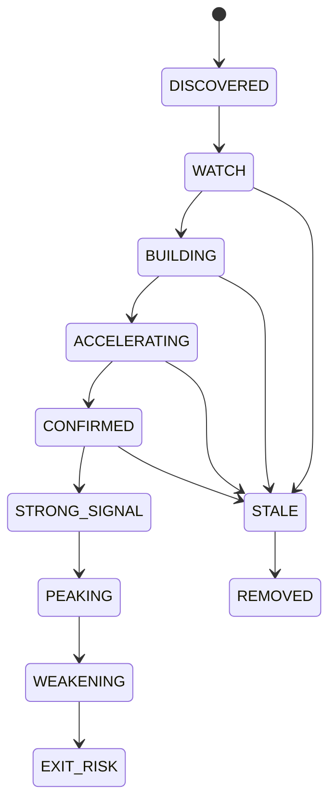

# Advanced B Signal States

The current implementation requires repeated qualifying evaluations before `CONFIRMED` and `STRONG_SIGNAL`. A single abnormal tick can produce `EXIT_RISK` or `STALE`, but cannot promote a token directly to `STRONG_SIGNAL`.
